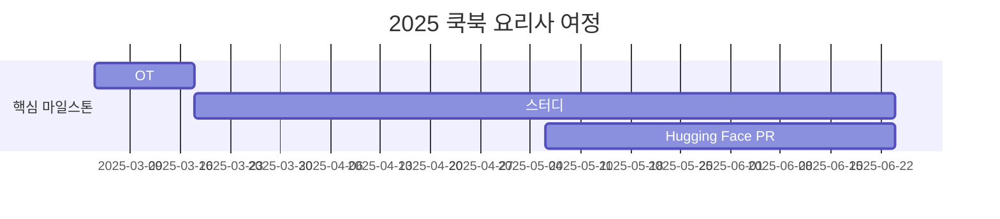

<h1 align="center"> 🤗 Hugging Face 쿡북 요리사 👨‍🍳</h1>

 

<!-- sheilds: https://shields.io/ -->
<!-- hits badge: https://hits.seeyoufarm.com/ -->

> Welcome to Hugging Face Cookbook Class Wars repository! We aim to democratize AI technology by translating/writing cookbooks of Hugging Face Community. Join us in advancing the field of AI through open collaboration and innovation!

## 🌟 프로젝트 목표 (Project Vision)
> 🙍🏻‍♂️ 💭 _transformers 라이브러리를 써본 적은 있긴 한데 Hugging Face에 대해서 더 자세히 알고 싶어! 🤩_  
> 🙍🏻‍♀️ 💭 _컴퓨터 비전, 자연어 처리, 이미지 생성 등 AI의 다양한 분야을 조금씩 알아보고 싶은데 어떻게 해야하지? 🤔_  
> 🙍🏻 💭 _스터디에 항상 열심히 참여하지만 끝나고 나면 누군가에게 자랑할만한 결과물이 남지가 않아 😢_ 

이런 고민을 하고 계신 분들을 위해 **🤗Hugging Face 쿡북 요리사**를 진행합니다!

_**"🤗 Hugging Face의 AI Cookbook을 활용해 코드와 함께 다양한 분야를 공부하고 Hugging Face에도 직접 기여하기!"**_  
- Hugging Face의 [AI Cookbook 노트북](https://huggingface.co/learn/cookbook/index)을 자료로 공부합니다.
- Hugging Face의 활용법을 포함한 다양한 분야의 AI 사용법을 배웁니다.
- 더 나아가, Cookbook의 번역 또는 집필하여 Hugging Face에 직접 기여하고 자신의 문서를 남길 수 있는 경험을 쌓을 수 있습니다.

## 🧑 팀 소개 (Team Members)

| 역할          | 이름 |  기술 스택 배지                                                                 | 주요 관심 분야                          |
|---------------|------|-----------------------------------------------------------------------|----------------------------------------|
| **Project Manager** | 정우준 |   | 멀티모달 / 비디오 이해            |
| **Project Manager** | 김준재 |   | NLP / MLOps                  |

## 🚀 프로젝트 로드맵 (Project Roadmap)

## 💻 주차별 활동 (Activity History)

| 날짜 | 내용 | 발표자 | 
| -------- | -------- | ---- |
| 2025/03/04 | OT (1)      |   김준재, 정우준   |
| 2025/03/11 |  Study (1) | 정우준 | 
| 2025/03/18 |  Study (2) | 김준재 | 
| 2025/03/25 |  1st. Magical Week | 모두🤗 |
| 2025/04/01 |  Study (3) | 미정 |
| 2025/04/08 |  Study (4) | 미정 |
| ... |  ... | ... | 
| 2025/04/29 |  2nd. Magical Week | 모두🤗 |
| 2025/06/10 |  Study (n) | 미정 | 

- **매주 스터디를 진행하며, 10주차부터는 스터디와 동시에 다 함께 Hugging Face 레포지토리에 PR을 올릴 예정입니다.**
- **발표는 매주 한 명씩 진행합니다.**
- **발표 순서와 발표 자료는 OT때 정할 예정입니다.**

## 🌱 참여 안내 (How to Engage)
**팀원으로 참여하시려면 러너 모집 기간에 신청해주세요.**  
- 링크 (준비중)

**🌟스터디 공지🌟**
- **매주 화요일 오후 9시 ~ 10시 / 디스코드 #Room-AN**
- **스터디 자료:** [Hugging Face AI Cookbook](https://huggingface.co/learn/cookbook/index)
 
**누구나 청강을 통해 모임을 참여하실 수 있습니다.**  
1. 특별한 신청 없이 정기 모임 시간에 맞추어 디스코드 채널로 입장
2. Magical Week 중 행사에 참가
3. Pseudo Lab 행사에서 만나기

## Hugging Face KREW

Hugging Face KREW는 가짜연구소의 리서치 팀입니다 🤗  
저희 팀은 Hugging Face와 관련된 다양한 스터디 및 기여 활동을 진행하고 있습니다!   
이번 10기에 진행하는 프로젝트는 아래와 같습니다.
- [Hugging Face Beyond First PR](https://github.com/Pseudo-Lab/Hugging-Face-Beyond-First-PR?tab=readme-ov-file)
- Hugging Face Hub Garden

Hugging Face KREW에 대해 자세히 알아보고 싶으시면 [이곳](https://calm-book-46f.notion.site/Hugging-Face-KREW-146f51a7c11780c3a6bfc1b72e9fd65e?pvs=4)에서 확인하세요🤗

## Acknowledgement 🙏

`Hugging Face Cookbook Class Wars` is developed as part of Pseudo-Lab's Open Research Initiative. Special thanks to our contributors and the open source community for their valuable insights and contributions.

## About Pseudo Lab 👋🏼</h2>

[Pseudo-Lab](https://pseudo-lab.com/) is a non-profit organization focused on advancing machine learning and AI technologies. Our core values of Sharing, Motivation, and Collaborative Joy drive us to create impactful open-source projects. With over 5k+ researchers, we are committed to advancing machine learning and AI technologies.

<h2>Contributors 😃</h2>

  

<h2>License 🗞</h2>

This project is licensed under the [MIT License](https://opensource.org/licenses/MIT).
